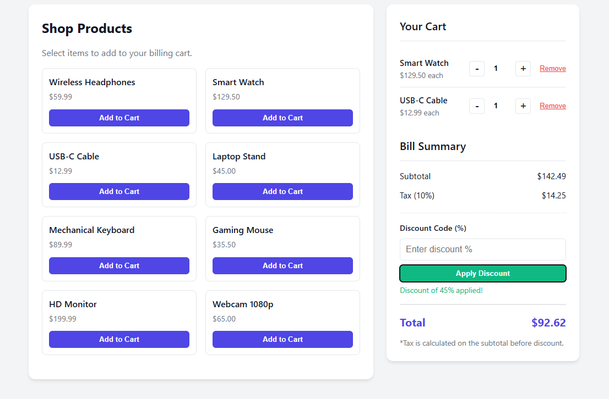

# 🛒 Shopping App Billing Calculator

## 1. Experiment Title
**Design and Implementation of a Dynamic Billing Calculator using HTML, CSS, and JavaScript**

## 2. Software/Tools Required
- **Language:** HTML5, CSS3, JavaScript (ES6+)
- **Editor:** Visual Studio Code (VS Code)
- **Browser:** Google Chrome / Firefox / Edge
- **Version Control:** Git & GitHub

## 3. Experiment Program Code
The complete source code is contained in the `index.html` file within this directory.

**Key Components:**
- **HTML Structure:** Semantic tags (`<section>`, `<article>`) for the product grid and cart summary.
- **CSS Styling:** Flexbox and Grid layout for responsive design; CSS variables for theming.
- **JavaScript Logic:**
  - **State Management:** Uses an object (`cart`) to track item quantities.
  - **DOM Manipulation:** Dynamically renders products and updates the cart UI without page reloads.
  - **Event Handling:** Listens for clicks on "Add," "Remove," and "Apply Discount" buttons.
  - **Math Logic:** Calculates Subtotal, Tax (10%), and Discount in real-time.


## 5. Case Study Title
**Billing Calculator**

## 6. Case Study Program Code
```html
<!DOCTYPE html>
<html lang="en">
<head>
    <meta charset="UTF-8">
    <meta name="viewport" content="width=device-width, initial-scale=1.0">
    <title>Shopping App Billing Calculator</title>
    <style>
        :root {
            --primary: #4f46e5;
            --primary-hover: #4338ca;
            --bg: #f3f4f6;
            --card-bg: #ffffff;
            --text-main: #111827;
            --text-muted: #6b7280;
            --border: #e5e7eb;
            --success: #10b981;
            --danger: #ef4444;
        }

        * {
            box-sizing: border-box;
            margin: 0;
            padding: 0;
        }

        body {
            font-family: -apple-system, BlinkMacSystemFont, "Segoe UI", Roboto, Helvetica, Arial, sans-serif;
            background-color: var(--bg);
            color: var(--text-main);
            line-height: 1.5;
            padding: 20px;
        }

        .container {
            max-width: 1000px;
            margin: 0 auto;
            display: grid;
            grid-template-columns: 1fr 350px;
            gap: 24px;
        }

        /* Responsive: Stack on mobile */
        @media (max-width: 768px) {
            .container {
                grid-template-columns: 1fr;
            }
        }

        /* Card Styles */
        .card {
            background: var(--card-bg);
            border-radius: 12px;
            box-shadow: 0 4px 6px -1px rgba(0, 0, 0, 0.1);
            padding: 24px;
            height: fit-content;
        }

        h1 {
            font-size: 1.5rem;
            font-weight: 700;
            margin-bottom: 16px;
            color: var(--text-main);
        }

        h2 {
            font-size: 1.25rem;
            font-weight: 600;
            margin-bottom: 16px;
            border-bottom: 1px solid var(--border);
            padding-bottom: 12px;
        }

        /* Product Grid */
        .product-grid {
            display: grid;
            grid-template-columns: repeat(auto-fill, minmax(200px, 1fr));
            gap: 16px;
            margin-bottom: 20px;
        }

        .product-card {
            border: 1px solid var(--border);
            border-radius: 8px;
            padding: 12px;
            transition: transform 0.2s, box-shadow 0.2s;
            display: flex;
            flex-direction: column;
            justify-content: space-between;
        }

        .product-card:hover {
            box-shadow: 0 4px 12px rgba(0,0,0,0.08);
            border-color: var(--primary);
        }

        .product-name {
            font-weight: 600;
            margin-bottom: 4px;
        }

        .product-price {
            color: var(--text-muted);
            font-size: 0.9rem;
            margin-bottom: 12px;
        }

        .add-btn {
            background-color: var(--primary);
            color: white;
            border: none;
            padding: 8px 16px;
            border-radius: 6px;
            cursor: pointer;
            font-weight: 600;
            transition: background-color 0.2s;
            width: 100%;
        }

        .add-btn:hover {
            background-color: var(--primary-hover);
        }

        /* Cart Styling */
        .cart-item {
            display: flex;
            justify-content: space-between;
            align-items: center;
            padding: 12px 0;
            border-bottom: 1px solid var(--border);
        }

        .cart-item:last-child {
            border-bottom: none;
        }

        .item-info {
            flex: 1;
        }

        .item-name {
            font-weight: 500;
            font-size: 0.95rem;
        }

        .item-price {
            font-size: 0.85rem;
            color: var(--text-muted);
        }

        .controls {
            display: flex;
            align-items: center;
            gap: 8px;
        }

        .qty-btn {
            width: 28px;
            height: 28px;
            border: 1px solid var(--border);
            background: white;
            border-radius: 4px;
            cursor: pointer;
            display: flex;
            align-items: center;
            justify-content: center;
            font-size: 1.2rem;
            line-height: 1;
            color: var(--text-main);
            transition: background-color 0.2s;
        }

        .qty-btn:hover {
            background-color: var(--bg);
        }

        .qty-input {
            width: 40px;
            text-align: center;
            border: none;
            font-weight: 600;
            padding: 4px 0;
        }

        .remove-btn {
            color: var(--danger);
            background: none;
            border: none;
            cursor: pointer;
            font-size: 0.8rem;
            margin-left: 8px;
            text-decoration: underline;
        }

        /* Summary Section */
        .summary-row {
            display: flex;
            justify-content: space-between;
            margin-bottom: 12px;
            font-size: 0.95rem;
        }

        .summary-row.total {
            margin-top: 16px;
            padding-top: 16px;
            border-top: 2px solid var(--border);
            font-size: 1.25rem;
            font-weight: 700;
            color: var(--primary);
        }

        .discount-input-group {
            margin-top: 20px;
            padding-top: 16px;
            border-top: 1px dashed var(--border);
        }

        .discount-input-group label {
            display: block;
            margin-bottom: 8px;
            font-weight: 500;
            font-size: 0.9rem;
        }

        .discount-input-group input {
            width: 100%;
            padding: 10px;
            border: 1px solid var(--border);
            border-radius: 6px;
            font-size: 1rem;
            margin-bottom: 8px;
        }

        .apply-discount-btn {
            background-color: var(--success);
            color: white;
            border: none;
            padding: 8px 16px;
            border-radius: 6px;
            cursor: pointer;
            font-weight: 600;
            width: 100%;
        }

        .apply-discount-btn:hover {
            background-color: #059669;
        }

        .tax-rate {
            font-size: 0.85rem;
            color: var(--text-muted);
            margin-top: 4px;
        }

        .empty-cart {
            text-align: center;
            color: var(--text-muted);
            padding: 20px 0;
            font-style: italic;
        }
    </style>
</head>
<body>

<div class="container">
    <!-- Product Selection Area -->
    <div class="card">
        <h1>Shop Products</h1>
        <p style="margin-bottom: 16px; color: var(--text-muted);">Select items to add to your billing cart.</p>
        
        <div class="product-grid" id="productGrid">
            <!-- Products will be injected here via JS -->
        </div>
    </div>

    <!-- Billing & Cart Area -->
    <div class="card">
        <h2>Your Cart</h2>
        <div id="cartItems">
            <div class="empty-cart">Your cart is empty. Add some items!</div>
        </div>

        <div style="margin-top: 24px;">
            <h2>Bill Summary</h2>
            
            <div class="summary-row">
                <span>Subtotal</span>
                <span id="subtotalDisplay">$0.00</span>
            </div>

            <div class="summary-row">
                <span>Tax (<span id="taxRateDisplay">10</span>%)</span>
                <span id="taxDisplay">$0.00</span>
            </div>

            <div class="discount-input-group">
                <label for="discountCode">Discount Code (%)</label>
                <input type="number" id="discountInput" min="0" max="100" placeholder="Enter discount %">
                <button class="apply-discount-btn" id="applyDiscountBtn">Apply Discount</button>
                <div id="discountMessage" style="color: var(--success); font-size: 0.85rem; margin-top: 4px; display: none;"></div>
            </div>

            <div class="summary-row total">
                <span>Total</span>
                <span id="totalDisplay">$0.00</span>
            </div>
            
            <p class="tax-rate">*Tax is calculated on the subtotal before discount.</p>
        </div>
    </div>
</div>

<script>
    // --- Configuration & Data ---
    const TAX_RATE = 0.10; // 10% Tax
    const products = [
        { id: 1, name: "Wireless Headphones", price: 59.99 },
        { id: 2, name: "Smart Watch", price: 129.50 },
        { id: 3, name: "USB-C Cable", price: 12.99 },
        { id: 4, name: "Laptop Stand", price: 45.00 },
        { id: 5, name: "Mechanical Keyboard", price: 89.99 },
        { id: 6, name: "Gaming Mouse", price: 35.50 },
        { id: 7, name: "HD Monitor", price: 199.99 },
        { id: 8, name: "Webcam 1080p", price: 65.00 }
    ];

    // State
    let cart = {}; // Object to store cart items: { productId: quantity }
    let discountPercent = 0;

    // --- DOM Elements ---
    const productGrid = document.getElementById('productGrid');
    const cartItemsContainer = document.getElementById('cartItems');
    const subtotalDisplay = document.getElementById('subtotalDisplay');
    const taxDisplay = document.getElementById('taxDisplay');
    const totalDisplay = document.getElementById('totalDisplay');
    const taxRateDisplay = document.getElementById('taxRateDisplay');
    const discountInput = document.getElementById('discountInput');
    const applyDiscountBtn = document.getElementById('applyDiscountBtn');
    const discountMessage = document.getElementById('discountMessage');

    // --- Initialization ---
    function init() {
        taxRateDisplay.textContent = (TAX_RATE * 100).toFixed(0);
        renderProducts();
    }

    // --- Render Products ---
    function renderProducts() {
        productGrid.innerHTML = '';
        products.forEach(product => {
            const card = document.createElement('div');
            card.className = 'product-card';
            card.innerHTML = `
                <div>
                    <div class="product-name">${product.name}</div>
                    <div class="product-price">$${product.price.toFixed(2)}</div>
                </div>
                <button class="add-btn" onclick="addToCart(${product.id})">Add to Cart</button>
            `;
            productGrid.appendChild(card);
        });
    }

    // --- Cart Logic ---
    function addToCart(productId) {
        if (cart[productId]) {
            cart[productId]++;
        } else {
            cart[productId] = 1;
        }
        renderCart();
    }

    function updateQuantity(productId, change) {
        if (cart[productId]) {
            const newQty = cart[productId] + change;
            if (newQty <= 0) {
                removeFromCart(productId);
            } else {
                cart[productId] = newQty;
                renderCart();
            }
        }
    }

    function removeFromCart(productId) {
        delete cart[productId];
        renderCart();
    }

    // --- Render Cart ---
    function renderCart() {
        cartItemsContainer.innerHTML = '';
        
        const productIds = Object.keys(cart);
        
        if (productIds.length === 0) {
            cartItemsContainer.innerHTML = '<div class="empty-cart">Your cart is empty. Add some items!</div>';
            updateTotals();
            return;
        }

        productIds.forEach(id => {
            const qty = cart[id];
            const product = products.find(p => p.id == id); // Use == for loose comparison with string keys
            
            const item = document.createElement('div');
            item.className = 'cart-item';
            item.innerHTML = `
                <div class="item-info">
                    <div class="item-name">${product.name}</div>
                    <div class="item-price">$${product.price.toFixed(2)} each</div>
                </div>
                <div class="controls">
                    <button class="qty-btn" onclick="updateQuantity(${product.id}, -1)">-</button>
                    <input type="number" class="qty-input" value="${qty}" readonly>
                    <button class="qty-btn" onclick="updateQuantity(${product.id}, 1)">+</button>
                    <button class="remove-btn" onclick="removeFromCart(${product.id})">Remove</button>
                </div>
            `;
            cartItemsContainer.appendChild(item);
        });

        updateTotals();
    }

    // --- Calculations ---
    function updateTotals() {
        let subtotal = 0;
        
        // Calculate Subtotal
        Object.keys(cart).forEach(id => {
            const qty = cart[id];
            const product = products.find(p => p.id == id);
            subtotal += product.price * qty;
        });

        // Calculate Tax (on Subtotal)
        const tax = subtotal * TAX_RATE;

        // Calculate Discount
        const discountAmount = subtotal * (discountPercent / 100);

        // Final Total
        const total = subtotal + tax - discountAmount;

        // Update DOM
        subtotalDisplay.textContent = `$${subtotal.toFixed(2)}`;
        taxDisplay.textContent = `$${tax.toFixed(2)}`;
        totalDisplay.textContent = `$${total.toFixed(2)}`;
    }

    // --- Discount Logic ---
    applyDiscountBtn.addEventListener('click', () => {
        const val = parseFloat(discountInput.value);
        if (isNaN(val) || val < 0 || val > 100) {
            discountMessage.textContent = "Please enter a valid percentage (0-100).";
            discountMessage.style.color = "var(--danger)";
            discountMessage.style.display = "block";
            return;
        }

        discountPercent = val;
        discountInput.value = ''; // Clear input
        discountMessage.textContent = `Discount of ${val}% applied!`;
        discountMessage.style.color = "var(--success)";
        discountMessage.style.display = "block";
        
        updateTotals();
    });

    // Run initialization
    init();

</script>

</body>
</html>
```


## 7. Output
*(Note to Student: Paste a second screenshot here showing the discount applied)*


*File Path: `Javascript/task2/index.html`*

## 8. Result/Conclusion
The Billing Calculator was successfully designed and implemented. The application demonstrates:
1.  **Dynamic DOM Manipulation:** The cart updates instantly when items are added or quantities change.
2.  **Data Validation:** The discount input validates that the percentage is between 0 and 100.
3.  **Responsive Design:** The layout adapts to different screen sizes.
4.  **Mathematical Accuracy:** The application correctly calculates the final total including tax and discounts.

---

### 📂 File Structure
```text
task2/
├── index.html      # Main application file (HTML, CSS, JS)
└── README.md       # This documentation file
